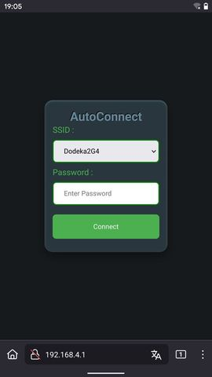
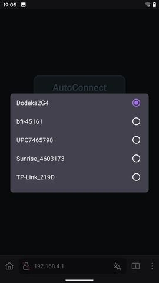
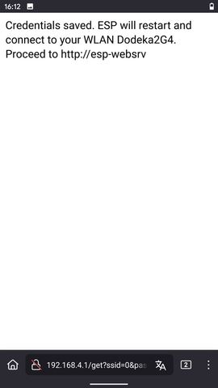
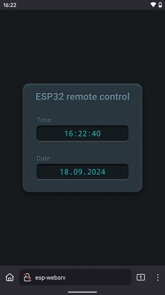

# Yet another ESP32AutoConnect
The ***ESP32AutoConnect*** library shows how the complexity of 
establishing a connection *without hard-coded credentials* can be 
encapsulated in a class. The method is well known, but its 
implementation is often difficult to understand and overloaded 
with many but rarely used features. This was the motivation to 
implement a simple *ESP32AutoConnect* class myself, which actually 
only had to do the following for my needs::

    void ESP32AutoConnect::autoConnect()
    {
        bool notConnected = true;

        if (credentialsAreAvailable())
        {
            if (weAreConnectedToWLAN(_ssid, _password))
            {
                notConnected = false; // ==> proceed with main loop
            }
            else
            {
            requestCredentialsAndRestart();
            }
        }
        else
        {
            requestCredentialsAndRestart();
        } 
        while (notConnected) { delay(100); } // wait for connection 
    }

The use in setup() is even simpler:

    Preferences prefs; // holds the WiFi credentials
    AsyncWebServer server(80);

    void setup() 
    {
        Serial.begin(115200);

        ESP32AutoConnect ac(server, prefs); 
        ac.setESPhostname(HOSTNAME);
        ac.autoConnect(); // start the autoconnect process and wait for connection

        handleWebUi(); // handle the main web page
        server.onNotFound(notFound);
        server.begin();
    }

The commented source code makes it even easier to understand.

## User Interface
|Connected to AutoConnectAP and http://192.168.4.1|Networks available to choose from|
|:-:|:-:|
|||

|Connection confirmation|Application web page|
|:-:|:-:|
|||

## Credits
Many thanks to [Stéphane Calderoni](https://m1cr0lab-esp32.github.io/remote-control-with-websocket), 
from whom I learned how to realize such appealing user interfaces.

